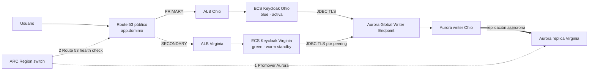

# Arquitectura

Recuperación regional de Keycloak sobre Aurora PostgreSQL Global Database, con un patrón **blue/green regional**: una región activa (blue) sirve el tráfico y la otra queda como *warm standby* (green), lista y ya corriendo. ARC Region switch invierte los roles.



El diagrama editable de toda la solución está en [diagrams](diagrams).

## Blue/green regional

Las dos regiones están desplegadas y en ejecución todo el tiempo, con la misma imagen y la misma configuración. Lo único asimétrico es quién es writer en Aurora y a qué ALB apunta el DNS público. Conmutar no despliega nada: sólo invierte esos dos estados.

Eso trae dos consecuencias que conviene decir en voz alta:

- El RTO no depende de aprovisionar cómputo, sino de la promoción de Aurora y de la propagación DNS.
- Se paga la región green todo el tiempo. Es la contrapartida explícita de un RTO bajo.

## Red

Cada región tiene su VPC con CIDR no superpuesto, dos AZ, subredes públicas para el ALB, privadas con salida por NAT para las tareas ECS, y subredes dedicadas para Aurora. El peering interregional tiene rutas recíprocas y resolución DNS habilitada: eso permite que el ECS de cualquiera de las dos regiones alcance por PostgreSQL al writer vigente.

Aurora no tiene acceso público. Las tareas ECS corren en subredes privadas sin IP pública y su security group sólo acepta tráfico del ALB de su región. Los security groups de Aurora permiten PostgreSQL desde los CIDR de las subredes de aplicación de **ambas** regiones, sin depender de referencias de security group entre regiones.

## Datos

Aurora Global Database mantiene el writer inicial en Ohio y una réplica asíncrona en Virginia, con una instancia Serverless v2 por región. Una instancia por clúster es una elección de demo y **no** equivale a alta disponibilidad completa dentro de una región.

`DB_HOST` es el Global Writer Endpoint del `aws_rds_global_cluster`, el mismo valor en las dos regiones. Cuando Aurora promueve Virginia, AWS reapunta ese hostname al nuevo writer. No hay RDS Proxy, ni CNAME de base de datos, ni Lambda de writer, ni cambio de DNS privado.

## DNS y TLS

El driver JDBC conecta con el hostname real del Global Writer Endpoint usando `sslmode=verify-full` y el bundle de CA de RDS como `sslrootcert`: se mantiene validación de cadena y de hostname. No se usa `sslmode=require` como sustituto. En Compose, `LOCAL_MODE` omite ese contrato contra un PostgreSQL local.

El pool renueva conexiones (`KC_DB_POOL_MAX_LIFETIME=30s`) y la caché DNS de Java queda acotada (`-Dsun.net.inetaddr.ttl=5`) para favorecer la reconexión después de una promoción. Eso no cancela transacciones en curso ni garantiza una recuperación instantánea.

`app.<dominio>` usa alias FAILOVER a los dos ALB con `evaluate_target_health=false`: sólo los health checks que genera ARC se asocian a esos registros, así el orden de la conmutación lo decide ARC y no Route 53. Los hostnames regionales (`use2.app`, `use1.app`) apuntan siempre a su propio ALB, para diagnóstico.

## Orquestación ARC

El plan de ARC Region switch tiene exactamente dos pasos:

1. Promover Aurora Global Database hacia la región destino.
2. Activar el health check Route 53 del registro público para dirigir `app.<dominio>` al ALB destino.

`arc_aurora_behavior` define el modo: `switchoverOnly` para una operación planificada, `failover` cuando se acepta posible pérdida. No hay fencing de ECS, ni gates Lambda, ni escalado de destino, ni gate OIDC.

Tampoco hay comprobación posterior a la promoción: ARC puede publicar el ALB destino mientras Keycloak todavía renueva DNS o conexiones. Ese período de indisponibilidad transitoria hay que medirlo y reportarlo en el ensayo. La continuidad de sesión de Keycloak no está garantizada; se admite re-login.

## Estructura del código

```
terraform/
├── modules/
│   ├── dr-architecture/     # stack: Global Database, ARC, DNS failover y las dos regiones
│   └── keycloak-region/     # composición regional: ECR, Aurora, ALB, ECS y servicio
└── examples/
    ├── lab/                # sobre una red existente
    └── complete/           # crea también VPC, NAT y peering
```

Todo se compone con los wrappers de la [Standard Platform de gocloudLa](https://github.com/gocloudLa): `wrapper-vpc`, `wrapper-peering`, `wrapper-rds-aurora`, `wrapper-alb`, `wrapper-ecs`, `wrapper-ecs-service` y `wrapper-ecr`. No se mezclan orígenes de módulos.

Quedan como `resource` suelto, y sólo porque no existe wrapper equivalente:

| Recurso | Por qué |
|---|---|
| `aws_rds_global_cluster` | Es el recurso que define la demo; ningún wrapper lo cubre |
| `aws_arcregionswitch_plan` y su rol IAM | ARC Region switch no tiene wrapper |
| `aws_route53_record` FAILOVER | Deben asociarse a los health checks que genera ARC |

### Providers por región, no el argumento `region`

El provider AWS v6 permite fijar `region` recurso por recurso y así evitar aliases. Acá no se puede: los wrappers resuelven VPC, subredes, security group por defecto, clúster ECS y listener del ALB con **data sources internos que no reciben `region`**. Si se fijara `region` sólo en los recursos, esos `data` seguirían resolviendo contra la región del provider y quedarían apuntando a la red equivocada.

De los recursos que sí declaramos, `aws_rds_global_cluster` y `aws_arcregionswitch_plan` aceptan `region`; `aws_route53_record`, `aws_iam_role` y `aws_iam_role_policy` no lo tienen porque son servicios globales. Aun así el módulo necesita los dos aliases para reenviarlos a `keycloak-region`, así que agregarles `region` no eliminaría nada y duplicaría la fuente de verdad. **Se mantienen `aws.primary` y `aws.secondary`.**

### Dependencias

Casi todas son implícitas, por referencia a atributos reales:

- El ALB y Aurora reciben **IDs de subred**, no patrones de tag.
- `wrapper-alb` no publica el nombre del ALB, así que se deriva del ARN del listener 443. Además de dar el nombre exacto, obliga a que el listener exista antes de que `wrapper-ecs-service` lo busque.
- En `examples/complete`, `vpc_name` es el tag `Name` real de la VPC creada.

Quedan dos `depends_on`, y son los que la [documentación de Terraform](https://developer.hashicorp.com/terraform/language/meta-arguments/depends_on) reserva para dependencias que no se pueden expresar con datos:

| Dónde | Por qué |
|---|---|
| `keycloak-region` → `module.ecs` | `wrapper-ecs` no publica ningún output: no hay atributo del clúster al que referirse |
| `examples/complete` → los dos `wrapper-vpc` | `wrapper-ecs-service` sólo acepta `subnet_name` por tag, nunca IDs |

## Interfaces

| Variable | Propósito |
|---|---|
| `DB_HOST` | Global Writer Endpoint de Aurora |
| `DB_PORT=5432`, `DB_NAME` | Conexión PostgreSQL |
| `sslmode=verify-full`, `sslrootcert` | TLS remoto con hostname y CA de RDS |
| `KC_DB_USERNAME`, `KC_DB_PASSWORD` | Parámetro SSM cifrado, inyectado como secreto de la task |
| `KC_BOOTSTRAP_ADMIN_USERNAME`, `KC_BOOTSTRAP_ADMIN_PASSWORD` | Administración inicial, también como secreto |
| `KC_HOSTNAME` | Nombre público canónico de Keycloak |
| `:9000/health/live`, `:9000/health/ready` | Liveness y readiness regionales |

## Fuentes

- [Conexión a una Aurora Global Database](https://docs.aws.amazon.com/AmazonRDS/latest/AuroraUserGuide/aurora-global-database-connecting.html)
- [SSL para RDS PostgreSQL](https://docs.aws.amazon.com/AmazonRDS/latest/UserGuide/PostgreSQL.Concepts.General.SSL.html)
- [ARC Region switch: bloque Aurora](https://docs.aws.amazon.com/r53recovery/latest/dg/aurora-global-database-block.html)
- [ARC Region switch: bloque Route 53](https://docs.aws.amazon.com/r53recovery/latest/dg/route53-health-check-block.html)
- [Health checks de Keycloak](https://www.keycloak.org/observability/health)
