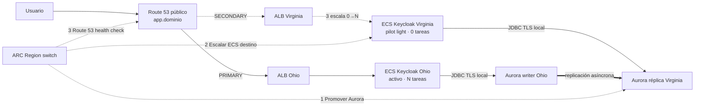

# Arquitectura

Recuperación regional de Keycloak sobre Aurora PostgreSQL Global Database, con un patrón **pilot light regional**: una región activa sirve el tráfico con su ECS corriendo; la otra tiene su clúster Aurora ya replicando pero el ECS en 0 tareas. ARC Region switch promueve Aurora, escala el ECS destino y recién entonces conmuta el DNS.



El diagrama editable de toda la solución está en [diagrams](diagrams).

## Pilot light regional

Las dos regiones tienen su clúster Aurora desplegado y replicando todo el tiempo, pero sólo la región activa corre tareas ECS. La región en espera queda en pilot light: su infraestructura (ALB, ECR, clúster ECS, security groups) ya existe, pero el servicio Keycloak tiene `desired_count=0` hasta que ARC lo escala como parte de la conmutación.

Eso trae consecuencias que conviene decir en voz alta:

- El RTO no depende sólo de la promoción de Aurora y de la propagación DNS: también suma el tiempo de arrancar tareas Fargate y el arranque de Keycloak (incluida la migración de esquema contra el clúster recién promovido).
- No se paga cómputo ECS de la región en espera mientras no hay conmutación; sí se paga el clúster Aurora replicando y el ALB. Es la contrapartida explícita de no depender de peering entre VPC.
- Cada Keycloak conecta siempre al clúster Aurora de su **propia** región, nunca al de la otra: no hay ninguna carga que necesite alcanzar por PostgreSQL una VPC remota.

## Red

Cada región tiene su VPC con CIDR no superpuesto, dos AZ, subredes públicas para el ALB, privadas con salida por NAT para las tareas ECS, y subredes dedicadas para Aurora. **No hace falta peering ni Transit Gateway entre las dos VPC**: como ningún Keycloak conecta a Aurora en la región opuesta, no hay tráfico cruzado que rutear.

Aurora no tiene acceso público. Las tareas ECS corren en subredes privadas sin IP pública y su security group sólo acepta tráfico del ALB de su región. Los security groups de Aurora sólo permiten PostgreSQL desde los CIDR de las subredes de aplicación de **su propia** región.

## Datos

Aurora Global Database mantiene el writer inicial en Ohio y una réplica asíncrona en Virginia, con una instancia provisioned por región (`aurora_instance_class`, memory-optimized; Aurora Global Database no admite clases burstable como `db.t3`/`db.t4g`). Una instancia por clúster es una elección de demo y **no** equivale a alta disponibilidad completa dentro de una región.

`DB_HOST` es el endpoint del clúster Aurora **regional**, distinto en cada región (no el Global Writer Endpoint compartido). Mientras una región es secundaria, su endpoint local es de sólo lectura, por eso el ECS de esa región permanece en 0 tareas: Keycloak no podría completar su migración de escritura contra un clúster de sólo lectura. Cuando ARC promueve el clúster, el mismo hostname empieza a aceptar escrituras sin que Keycloak deba reconectar a otro host. No hay RDS Proxy, ni CNAME de base de datos, ni Lambda de writer, ni cambio de DNS privado.

## DNS y TLS

El driver JDBC conecta con el hostname real del clúster Aurora regional usando `sslmode=verify-full` y el bundle de CA de RDS como `sslrootcert`: se mantiene validación de cadena y de hostname. No se usa `sslmode=require` como sustituto. En Compose, `LOCAL_MODE` omite ese contrato contra un PostgreSQL local.

El pool renueva conexiones (`KC_DB_POOL_MAX_LIFETIME=30s`) y la caché DNS de Java queda acotada (`-Dsun.net.inetaddr.ttl=5`); en el patrón pilot light esto es principalmente defensivo, porque cada Keycloak arranca una sola vez contra su endpoint local ya promovido.

`app.<dominio>` usa alias FAILOVER a los dos ALB con `evaluate_target_health=false`: sólo los health checks que genera ARC se asocian a esos registros, así el orden de la conmutación lo decide ARC y no Route 53. Los hostnames regionales (`use2.app`, `use1.app`) apuntan siempre a su propio ALB, para diagnóstico.

## Orquestación ARC

El plan de ARC Region switch tiene exactamente tres pasos, en orden estricto:

1. Promover Aurora Global Database hacia la región destino (`AuroraGlobalDatabase`).
2. Escalar el ECS Keycloak de la región destino de 0 a N tareas (`ECSServiceScaling`), igualando la capacidad de la región origen (`target_percent=100`). Recién acá arranca Keycloak en la región destino, con su clúster Aurora ya promovido y escribible.
3. Activar el health check Route 53 del registro público para dirigir `app.<dominio>` al ALB destino (`Route53HealthCheck`).

`arc_aurora_behavior` define el modo del paso 1: `switchoverOnly` para una operación planificada, `failover` cuando se acepta posible pérdida. No hay gates Lambda ni gate OIDC.

El paso 2 sí es un gate real: ARC espera a que el ECS destino alcance la capacidad pedida (o el timeout) antes de pasar al paso 3, así que el DNS no se mueve hacia un backend sin tareas corriendo. No hay comprobación de que Keycloak ya pasó su health check de aplicación (`/health/ready`) más allá de lo que el propio ECS/ALB reportan; ese período de arranque hay que medirlo y reportarlo en el ensayo. La continuidad de sesión de Keycloak no está garantizada; se admite re-login.

## Estructura del código

La orquestación es Terragrunt por capas:

```
terragrunt/                          # orquestación por capas
├── root.hcl                         # backend local, un state por capa
├── project/
│   ├── drarch-global/laboratory/    # aws_rds_global_cluster y credenciales
│   ├── drarch-use2/laboratory/      # Ohio: ECR, Aurora, ALB, clúster ECS
│   └── drarch-use1/laboratory/      # Virginia: ídem
└── workload/
    ├── drarch-use2/laboratory/      # Ohio: ECS service
    ├── drarch-use1/laboratory/      # Virginia: ECS service en 0 tareas
    └── drarch-arc/laboratory/       # plan de ARC, rol IAM y DNS failover
```

Las capas no son una preferencia estética: los wrappers resuelven ALB, target groups y
clúster ECS con data sources internos cuyo `for_each`/`count` depende de recursos que no
existen todavía, así que un único state no puede expandir el grafo y el plan falla con
`Invalid for_each argument`. Separado en capas, cada una planifica cuando lo de abajo ya
existe. Detalle y DAG en [terragrunt/README.md](../terragrunt/README.md).

La red (VPC, subredes, NAT) se asume preexistente y se resuelve por tag `Name`. No hace falta
peering ni conectividad interregional: cada Keycloak conecta al clúster Aurora de su propia
región (pilot light).

Todo se compone con los wrappers de la [Standard Platform de gocloudLa](https://github.com/gocloudLa): `wrapper-rds-aurora`, `wrapper-alb`, `wrapper-ecs`, `wrapper-ecs-service` y `wrapper-ecr`. No se mezclan orígenes de módulos.

Quedan como `resource` suelto, y sólo porque no existe wrapper equivalente:

| Recurso | Por qué |
|---|---|
| `aws_rds_global_cluster` | Es el recurso que define la demo; ningún wrapper lo cubre |
| `aws_arcregionswitch_plan` y su rol IAM | ARC Region switch no tiene wrapper |
| `aws_route53_record` FAILOVER | Deben asociarse a los health checks que genera ARC |
| `data.aws_rds_cluster` (en la capa `project` regional) | El wrapper de Aurora no publica el endpoint del clúster regional como output |

### Providers por región, no el argumento `region`

El provider AWS v6 permite fijar `region` recurso por recurso y así evitar aliases. Acá no se puede: los wrappers resuelven VPC, subredes, security group por defecto, clúster ECS y listener del ALB con **data sources internos que no reciben `region`**. Si se fijara `region` sólo en los recursos, esos `data` seguirían resolviendo contra la región del provider y quedarían apuntando a la red equivocada.

De los recursos que sí declaramos, `aws_rds_global_cluster` y `aws_arcregionswitch_plan` aceptan `region`; `aws_route53_record`, `aws_iam_role` y `aws_iam_role_policy` no lo tienen porque son servicios globales. Cada capa regional corre con el provider de su propia región, así que no hace falta duplicar `region` recurso por recurso.

### Dependencias

Dentro de cada capa, casi todas son implícitas, por referencia a atributos reales:

- El ALB y Aurora reciben **IDs de subred**, no patrones de tag.
- `wrapper-alb` no publica el nombre del ALB, así que se deriva del ARN del listener 443. Además de dar el nombre exacto, obliga a que el listener exista antes de que `wrapper-ecs-service` lo busque.

Entre capas, el orden lo garantiza el DAG de Terragrunt (`dependency`/`dependencies`), no
`depends_on`: cuando una capa planifica, los recursos de las capas de abajo ya existen y se
resuelven con data sources o llegan como outputs concretos. Ése es justamente el problema que
la separación en capas elimina.

## Interfaces

| Variable | Propósito |
|---|---|
| `DB_HOST` | Endpoint del clúster Aurora **de esta región** (no el Global Writer Endpoint compartido) |
| `DB_PORT=5432`, `DB_NAME` | Conexión PostgreSQL |
| `sslmode=verify-full`, `sslrootcert` | TLS local con hostname y CA de RDS |
| `KC_DB_USERNAME`, `KC_DB_PASSWORD` | Parámetro SSM cifrado, inyectado como secreto de la task |
| `KC_BOOTSTRAP_ADMIN_USERNAME`, `KC_BOOTSTRAP_ADMIN_PASSWORD` | Administración inicial, también como secreto |
| `KC_HOSTNAME` | Nombre público canónico de Keycloak |
| `:9000/health/live`, `:9000/health/ready` | Liveness y readiness regionales |

El output `global_writer_endpoint` del stack sigue existiendo (agrupa los dos clústeres regionales bajo el `aws_rds_global_cluster`), pero es sólo diagnóstico: ningún `DB_HOST` de Keycloak lo usa.

## Fuentes

- [Conexión a una Aurora Global Database](https://docs.aws.amazon.com/AmazonRDS/latest/AuroraUserGuide/aurora-global-database-connecting.html)
- [SSL para RDS PostgreSQL](https://docs.aws.amazon.com/AmazonRDS/latest/UserGuide/PostgreSQL.Concepts.General.SSL.html)
- [ARC Region switch: bloque Aurora](https://docs.aws.amazon.com/r53recovery/latest/dg/aurora-global-database-block.html)
- [ARC Region switch: bloque Route 53](https://docs.aws.amazon.com/r53recovery/latest/dg/route53-health-check-block.html)
- [Health checks de Keycloak](https://www.keycloak.org/observability/health)
